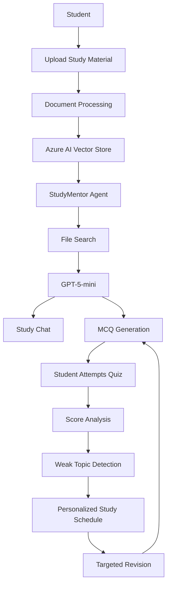
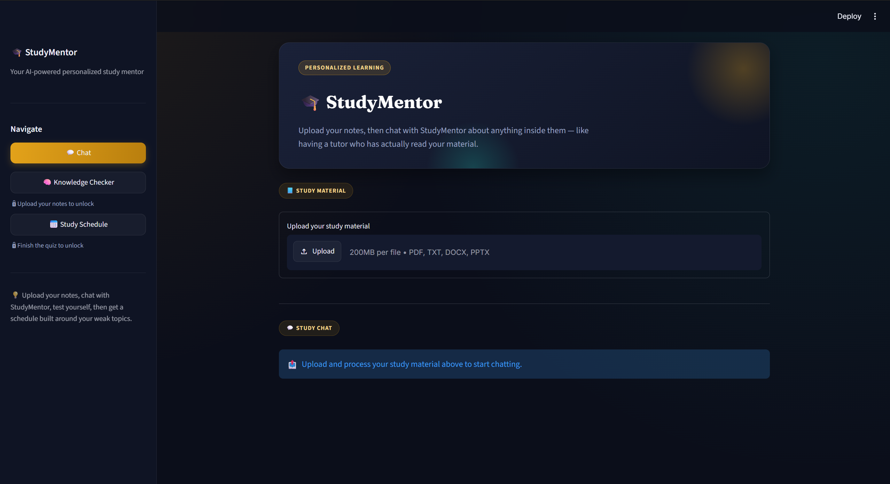
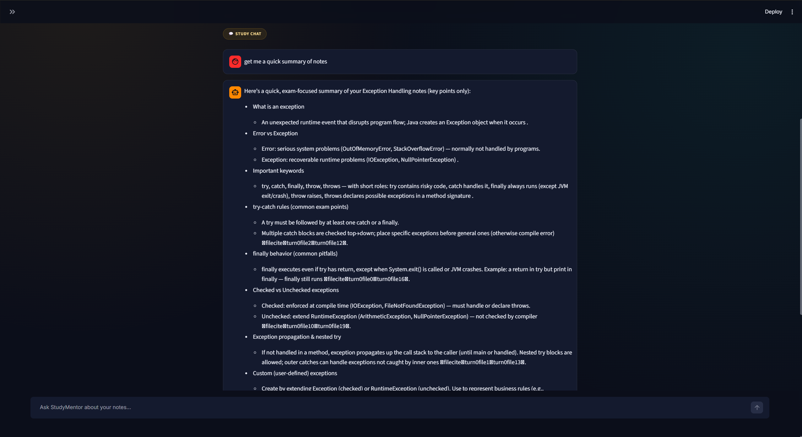
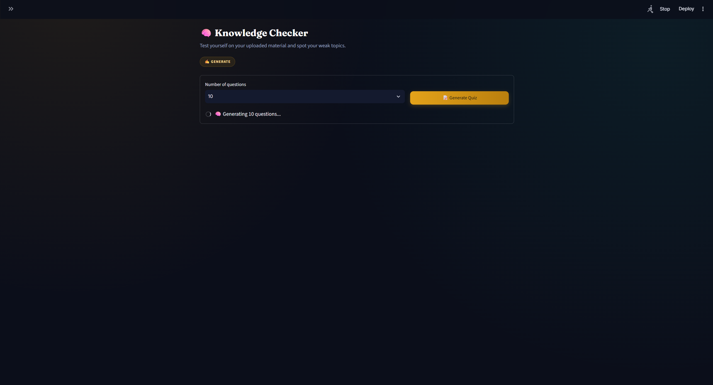
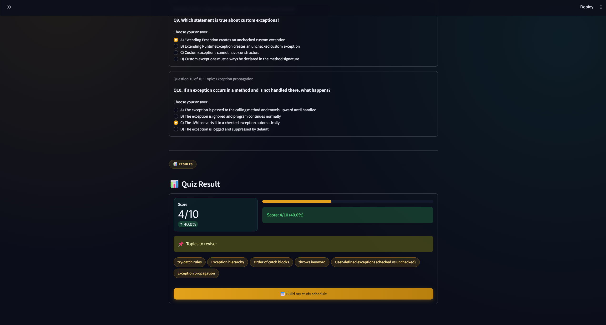
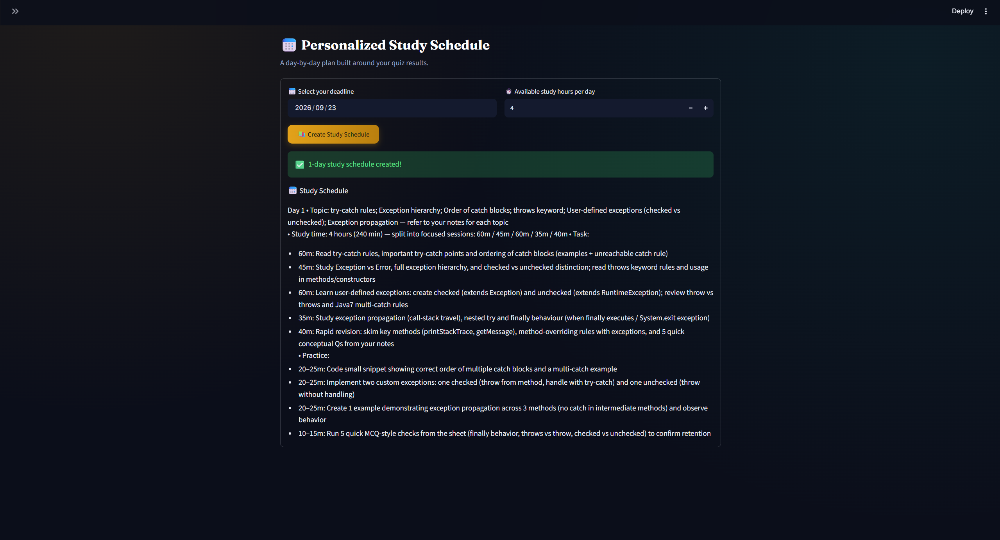

# 🎓 StudyMentor

> **AI-powered personalized study assistant that turns your study material into an interactive learning experience.**

StudyMentor is an AI-based education assistant built to help students **understand their own notes, practice through quizzes, identify weak topics, and generate personalized study schedules**.

The project uses **Microsoft Foundry / Azure AI**, **GPT-5-mini**, **File Search with vector stores**, and **Streamlit** to create a study workflow that adapts to the student's performance.

---

## ✨ Why StudyMentor?

Traditional study tools often provide generic explanations and questions.

StudyMentor follows a different approach:

**Your Notes → AI Understanding → Practice → Performance Analysis → Personalized Revision**

The system uses the student's uploaded study material as the primary knowledge source, allowing students to ask questions and generate exam-oriented practice based on their own notes.

---

## 🚀 Key Features

### 📚 1. Study Material Upload
Upload your study material directly into the application.

Supported formats:

- PDF
- TXT
- DOCX
- PPTX

The uploaded material is processed and made searchable through an Azure AI vector store.

### 💬 2. AI Study Chat

Ask questions about your uploaded notes.

StudyMentor can provide:

- Simple explanations
- Quick summaries
- Exam-oriented answers
- Concept clarification
- Topic-specific questions

The AI is instructed to use **File Search** when answering questions related to the uploaded material.

### 🧠 3. Knowledge Checker

Generate interactive MCQs from your study material.

Students can:

- Choose the number of questions
- Attempt generated MCQs
- Submit answers
- View their score
- Identify topics that need revision

### 📊 4. Weak Topic Detection

After completing a quiz, StudyMentor analyzes incorrect responses and identifies topics that require more revision.

Example:

```text
Quiz Score: 4/10

Topics to revise:
• try-catch rules
• Exception hierarchy
• Order of catch blocks
• throws keyword
• Exception propagation
```

### 📅 5. Personalized Study Schedule

StudyMentor uses:

- Quiz performance
- Weak topics
- Exam/deadline
- Available study hours

to generate a day-by-day study plan.

Example:

```text
Day 1
├── Study: Exception hierarchy
├── Study: try-catch rules
├── Study: throws keyword
├── Practice: Custom exceptions
└── Revision: Quick MCQ check
```

---

# 🔄 Project Workflow



---

# 🏗️ System Architecture

```text
                         ┌─────────────────────┐
                         │       Student       │
                         └──────────┬──────────┘
                                    │
                                    ▼
                         ┌─────────────────────┐
                         │    Streamlit UI     │
                         │                     │
                         │ • Upload Notes      │
                         │ • Study Chat        │
                         │ • Knowledge Checker │
                         │ • Study Schedule    │
                         └──────────┬──────────┘
                                    │
                                    ▼
                         ┌─────────────────────┐
                         │  Study Materials    │
                         │ PDF/TXT/DOCX/PPTX   │
                         └──────────┬──────────┘
                                    │
                                    ▼
                         ┌─────────────────────┐
                         │ Azure AI Vector     │
                         │ Store + File Search │
                         └──────────┬──────────┘
                                    │
                                    ▼
                         ┌─────────────────────┐
                         │  StudyMentor Agent  │
                         │   GPT-5-mini        │
                         └──────────┬──────────┘
                                    │
                 ┌──────────────────┼──────────────────┐
                 ▼                  ▼                  ▼
          ┌─────────────┐    ┌─────────────┐    ┌──────────────┐
          │ Study Chat  │    │ Quiz Engine │    │ Study Planner│
          └──────┬──────┘    └──────┬──────┘    └──────┬───────┘
                 │                  │                  │
                 │                  ▼                  │
                 │           ┌─────────────┐            │
                 │           │ Quiz Score  │            │
                 │           └──────┬──────┘            │
                 │                  ▼                   │
                 │           ┌─────────────┐            │
                 │           │ Weak Topics │────────────┘
                 │           └─────────────┘
                 │
                 └─────────────────────────────────────►
                         Personalized Learning Loop
```

---

# 🧩 Core AI Pipeline

The central AI pipeline can be understood in five stages:

### 1️⃣ Ingest

The student uploads their notes.

```text
PDF / TXT / DOCX / PPTX
            ↓
      Study Materials
```

### 2️⃣ Retrieve

The material is connected to a vector store and searched using **File Search**.

```text
Student Question
       ↓
   File Search
       ↓
Relevant Notes
```

### 3️⃣ Generate

The retrieved information is provided to the StudyMentor agent powered by **GPT-5-mini**.

```text
Relevant Notes + User Question
              ↓
         GPT-5-mini
              ↓
      Exam-focused Answer
```

### 4️⃣ Assess

The system generates MCQs from the uploaded material and evaluates the student's answers.

```text
Study Material
      ↓
MCQ Generation
      ↓
Student Attempts
      ↓
Score
```

### 5️⃣ Personalize

Incorrect answers are converted into weak-topic signals and used to build a personalized study schedule.

```text
Quiz Performance
       ↓
Weak Topics
       ↓
Available Study Time
       ↓
Exam/Deadline
       ↓
Personalized Schedule
```

---

# 🛠️ Technology Stack

| Technology | Purpose |
|---|---|
| **Python** | Core application logic |
| **Streamlit** | Interactive web interface |
| **Microsoft Foundry / Azure AI** | AI application infrastructure |
| **Azure AI Projects** | Project and agent integration |
| **GPT-5-mini** | AI reasoning and response generation |
| **File Search** | Retrieval from uploaded study material |
| **Vector Store** | Searchable knowledge base |
| **Azure Identity** | Authentication using Azure credentials |
| **Git & GitHub** | Version control and collaboration |

---

# 📁 Project Structure

```text
StudyMentor/
│
├── .streamlit/
│   └── config.toml
│
├── app.py
│   └── Main Streamlit application
│
├── setup.py
│   └── StudyMentor agent configuration
│
├── requirements.txt
│   └── Python dependencies
│
├── .gitignore
│   └── Files excluded from Git
│
└── README.md
    └── Project documentation
```

---

# ⚙️ Installation & Setup

## 1. Clone the repository

```bash
git clone https://github.com/MihirKhatter23/StudyMentor.git
cd StudyMentor
```

## 2. Create a virtual environment

```bash
python -m venv .venv
```

### Windows PowerShell

```powershell
.\.venv\Scripts\Activate.ps1
```

If the environment is already active, you will see:

```text
(.venv)
```

## 3. Install dependencies

```bash
pip install -r requirements.txt
```

## 4. Authenticate with Azure

StudyMentor uses `DefaultAzureCredential`.

For local development, authenticate using Azure CLI:

```bash
az login
```

Make sure the signed-in Azure account has access to the required Azure AI project/resources.

## 5. Configure the Azure AI project

Update the project configuration in `setup.py` with your Azure AI project endpoint and required vector-store configuration.

> **Security:** Never commit API keys, passwords, tokens, or other secrets to GitHub.

---

# ▶️ Run the Application

From the project directory:

```bash
streamlit run app.py
```

Streamlit will open the StudyMentor application in your browser.

If it does not open automatically, use the local URL shown in the terminal, normally:

```text
http://localhost:8501
```

---

# 🎯 How to Use StudyMentor

### Step 1 — Upload Notes

Upload your PDF, TXT, DOCX, or PPTX study material.

### Step 2 — Ask Questions

Use **Study Chat** to ask questions about the uploaded material.

Examples:

```text
Give me a quick summary of these notes.

Explain exception propagation with an example.

What are the most important exam points?

Explain this topic in simple language.
```

### Step 3 — Take a Quiz

Open **Knowledge Checker** and select the number of questions.

```text
Generate Quiz
      ↓
Attempt MCQs
      ↓
Submit
      ↓
View Score
```

### Step 4 — Find Weak Topics

The application identifies topics associated with incorrect answers.

### Step 5 — Build a Study Schedule

Provide:

- Exam/deadline
- Available study hours

StudyMentor generates a focused schedule around the identified weak topics.

---

# 🔁 Personalized Learning Loop

The main idea behind StudyMentor is a continuous feedback loop:

```text
        ┌──────────────────────┐
        │   Upload Study Notes │
        └──────────┬───────────┘
                   ↓
        ┌──────────────────────┐
        │      Study Chat      │
        └──────────┬───────────┘
                   ↓
        ┌──────────────────────┐
        │     Take Quiz        │
        └──────────┬───────────┘
                   ↓
        ┌──────────────────────┐
        │ Analyze Performance  │
        └──────────┬───────────┘
                   ↓
        ┌──────────────────────┐
        │ Detect Weak Topics   │
        └──────────┬───────────┘
                   ↓
        ┌──────────────────────┐
        │ Create Study Plan    │
        └──────────┬───────────┘
                   ↓
        ┌──────────────────────┐
        │ Targeted Revision    │
        └──────────┬───────────┘
                   │
                   └──────────────► Take Quiz Again
```

This creates an adaptive study cycle instead of a one-time question-answer system.

---

## 🖥️ Application Screenshots

### 🏠 StudyMentor Dashboard

The main dashboard allows students to upload their study material and access the learning modules.



---

### 💬 Study Chat

Students can ask questions and receive exam-oriented explanations based on their uploaded notes.



---

### 🧠 Knowledge Checker

Students can generate and attempt MCQs from their study material.



---

### 📊 Quiz Results

The system displays the quiz score and topics that require revision.



---

### 📅 Personalized Study Schedule

The study planner converts quiz performance and available study time into a focused revision plan.



---

# 📸 Suggested GitHub Screenshot Layout

For a polished repository, keep screenshots in:

```text
docs/
└── screenshots/
    ├── dashboard.png
    ├── study-chat.png
    ├── knowledge-checker.png
    ├── quiz-results.png
    └── study-schedule.png
```

Then replace the screenshot placeholders above with:

```markdown

```

---

# 🔐 Security

The repository should never contain:

```text
API keys
Access tokens
Passwords
Client secrets
Private credentials
.env files containing secrets
```

The `.gitignore` file should prevent sensitive/local files from being committed.

For local development, use Azure authentication such as:

```bash
az login
```

and keep secrets outside the repository.

---

# 🚧 Future Improvements

Possible future extensions include:

- 📈 Detailed learning analytics dashboard
- 🧑‍🎓 Student profiles and persistent progress
- 📝 Automatic note summarization
- 🎤 Viva / oral-question practice
- 🔄 Adaptive quiz difficulty
- 📊 Topic-wise performance charts
- ⏰ Study reminders
- 📚 Multiple-subject support
- 🤖 More specialized AI agents
- ☁️ Cloud deployment
- 📱 Mobile-friendly interface

---

# 👨‍💻 Team

This project was developed collaboratively by:

| Team Member | Course | GitHub | LinkedIn |
|---|---|---|---|
| **Mihir Khatter** | B.Tech CSE (AI) | [GitHub](https://github.com/MihirKhatter23) | [LinkedIn](https://www.linkedin.com/in/mihir-khatter-26b0b2324) |
| **Rahul** | B.Tech CSE (AI) | — | — |
| **Parth** | B.Tech CSE (AI) | — | — |
| **Deepak Garg** | B.Tech CSE (AI) | — | — |

---

# 🎓 Project Objective

StudyMentor aims to make studying more **personalized, interactive, and feedback-driven**.

Instead of simply asking an AI general questions, the student provides their own study material and follows a complete learning pipeline:

> **Learn → Ask → Practice → Analyze → Revise → Improve**

---

# ⭐ Project Highlights

- 📚 Study directly from personal notes
- 🔎 Retrieval using File Search and vector stores
- 🤖 GPT-5-mini powered StudyMentor agent
- 💬 Context-aware study chat
- 🧠 AI-generated MCQs
- 📊 Automatic quiz performance analysis
- 🎯 Weak-topic identification
- 📅 Personalized study planning
- 🔄 Feedback-driven learning workflow
- ☁️ Built using Microsoft Foundry / Azure AI

---

# 📜 License

This project is currently intended for **educational and academic purposes**.

A formal open-source license can be added to the repository later if required.

---

## 🔗 Project Links

**GitHub Repository:**  
https://github.com/MihirKhatter23/StudyMentor

**Developer — Mihir Khatter:**  
https://github.com/MihirKhatter23

**LinkedIn:**  
https://www.linkedin.com/in/mihir-khatter-26b0b2324
